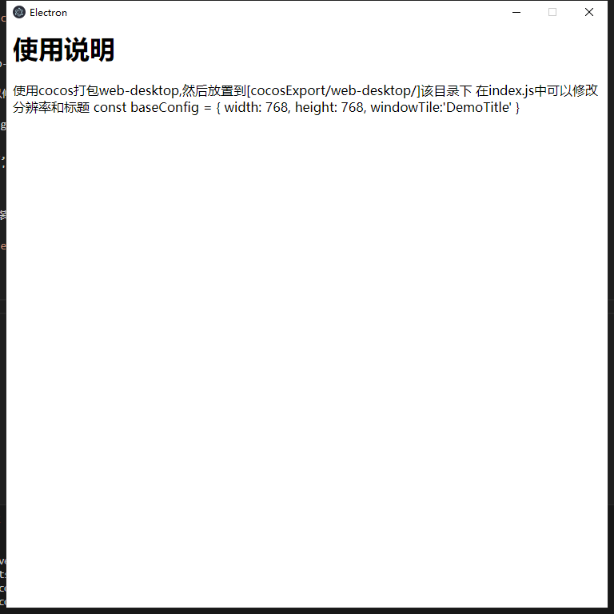

### 使用说明
使用前请先全局安装 electron,要不然无法识别 electron 命令
```bash
npm install electron -g
```

使用cocos打包web-desktop,然后放置到[cocosExport/web-desktop/]该目录下

在index.js中可以修改分辨率和标题

const baseConfig = {
    width: 768,
    height: 768,
    windowTile:'DemoTitle'
}

运行项目前请先安装依赖
```bash
npm install -D electron
npm run start
```


